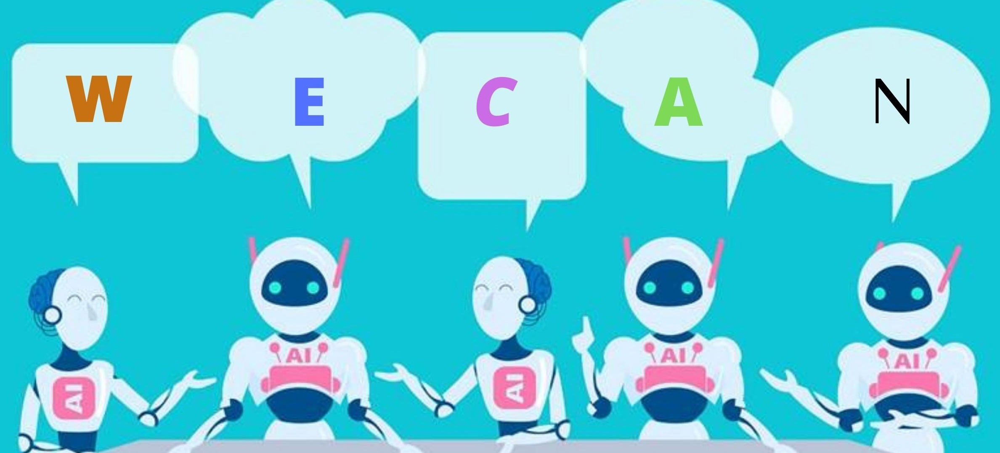

<h1 align="center">Hi 👋, I'm Kishan Dewangan</h1>
<h3 align="center">A Passionate Blockchian Application Developer</h3>

- 🌱 I’m currently learning **BlockChain Technology**

- 📫 How to reach me **kishan.dewangan123@gmail.com**

<h3 align="left">Connect with me:</h3>

<

<h3 align="left">Languages and Tools:</h3>

            

